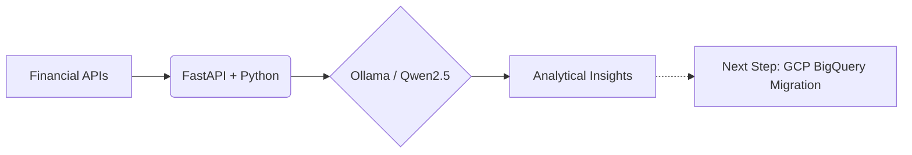

# 👋 Hi, I’m Deepan Mehta  
> ### "When learning meets data, growth becomes measurable and inevitable."

>**Learning:** 🎓 Google Professional Data Engineer  
>**Building:** 📈 [AI-Driven Financial Dashboard](https://github.com) (llama + FastAPI + Qwen2.5) on Local System -> Later Cloud.

>**Data Engineering | AI & Data Analytics | Learning and Development | EdTech | Lifelong Learning**
---

## 🌟 About Me  

I’m a data-driven professional passionate about applying **AI, Data Engineering and Analytics** to improve **Learning and Development (L&D)** outcomes.

After a successful career in **Aviation training and Airport operations**, I’ve transitioned toward **data engineering and data analytics**, where I can apply analytical methods to solve learning and business problems.  

I am engaged in transforming data into insights, building dashboards, and designing data-informed solutions.  

**Current focus:** AI Agents • LLM's • Building analytics projects and applications in Python • Excel • and R.  
**Upcoming focus:** Data Engineering / AI-driven Learning / Analytics and EdTech solutions for Corporate Training / Learning and Development

---

## 🧠 Core Competencies  

**Data Analytics:** Excel • SQL • R • Python • MySQL • BigQuery  
**Visualization & Reporting:** Tableau • Looker Studio • ggplot2  
**AI & Automation:** Prompt Engineering • AI Agents • Automation • Predictive Analytics  
**Learning & EdTech:** Instructional Design    
**Development (Legacy Projects):** PHP • MySQL • JavaFX • HTML/CSS  
**Soft Skills:** Facilitation • Analytical Thinking • Communication • Continuous Learning  

---
**Programming & Analysis:**  

**Visualization & Reporting:**  

---
## 💼 Featured Projects  

| Project | Description | Tools |
|----------|--------------|-------|
| [🚴 Cyclistic Bike-Share Analysis ](https://github.com/deepan-mehta-analytics/cyclistic-bike-share-analysis) | Google Data Analytics Capstone: analyzed two Q1 quarters of ride data to compare casual vs. member behavior. | Python, Excel, Pivot Tables, Charts, Tableau Dashboard, Power-point |
| [📊 Python Sales Analytics](https://github.com/deepan-mehta-analytics/Python-Sales-Analytics-Project) | Sales dataset analysis using Python — cleaning, visualization, and insights(Work-In-Progress)  | Python, pandas, seaborn |
| [🧑‍💼 Financial Portfolio Analytics ](https://github.com/deepan-mehta-analytics/Python-HR-Analytics-Project) | Stocks analysis to analyze portfolios and Stocks (Work-In-Progress) | Python, pandas, matplotlib, llama, FastAPI  |
| [🎓 Education Analytics](https://github.com/deepan-mehta-analytics/Python-Education-Analytics-Project) | Analyze student performance data to discover learning patterns.(Work-In-Progress) | Python, pandas, plotly |
| [🛫 BCA Project — Aircraft Weight & Balance Application](https://github.com/deepan-mehta-analytics/BCA-Project-Aircraft-A310-Load-Sheet-App) | Laravel application for aircraft weight & balance calculations. (Work-In-Progress, converting from legacy PHP) | Laravel, PHP, MySQL |
| [🧾 MCA Project — Training Records Management Application](https://github.com/deepan-mehta-analytics/MCA-Project-Training-Records-Management-System) | JavaFX desktop application for managing and reporting training records.(Work-In-Progress, converting from deprecated JavaFX) | JavaFX, MySQL, Maven |
---
## 📈 Featured Project (Work-in progress): AI-Driven Financial Dashboard
> **Status:** Phase 1 (Local Analytics & AI Foundations)

This project integrates my **Google/IBM Data Analytics** background with modern AI (Ollama/Qwen2.5) to analyze market trends. I am currently transitioning this architecture to **Google Cloud Platform** as part of my PDE certification journey.

### 🛠️ Roadmap: Transitioning to Google Cloud (PDE Phase)
To move from local analytics to a scalable cloud architecture, the following is being implemented:

-   **Data Ingestion:** Local CSV/API pulls are being migrated to **Google Cloud Storage (GCS)** for durable staging.
-   **Data Warehousing:** A **BigQuery** schema is being designed with **Partitioning** and **Clustering** to optimize analytical query costs.
-   **AI Integration:** Local Ollama inference is transitioning to **Vertex AI (Gemini)** for production-grade model scaling.
-   **Automation:** **Cloud Functions** are being used to trigger FastAPI endpoints when new stock data is uploaded to GCS.

---

## 🎓 Certifications  

- GOOGLE Data Analytics Professional Certificate   
- IBM Data Analytics Professional Certificate with Excel & R   
- IATA Professional Skills for Dangerous Goods Instructors  
- SITA DCS & Load Sheet Certified  

---

My mission is to bridge **Data Engineering and Learning** — using data to make education and training more effective.

---

## 📫 Contact  

📍 Mumbai, India  
📧 supernova.surfer@gmail.com  
🔗 [LinkedIn](your-link)  
💼 [GitHub Projects](https://github.com/deepan-mehta-analytics?tab=repositories)

---

> “When learning meets data, growth becomes measurable and inevitable .”
