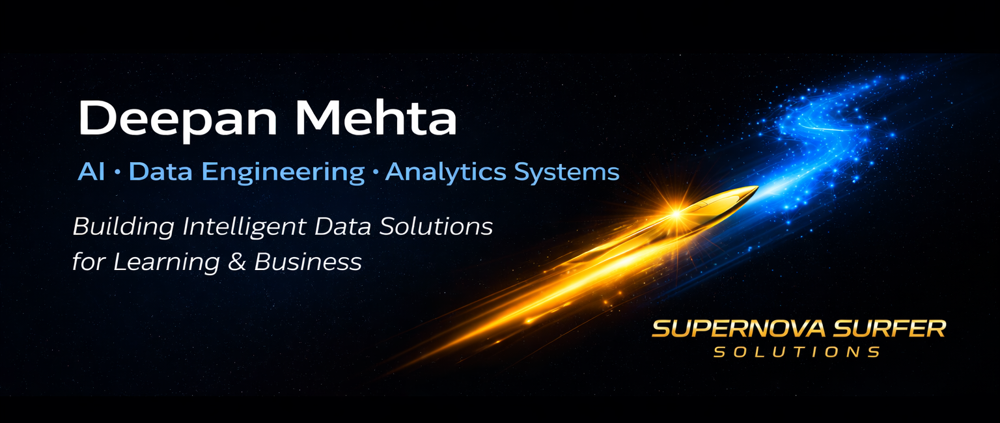
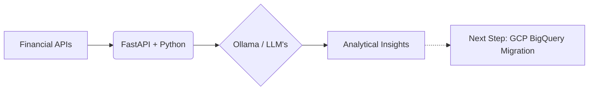

  

## 👋 Hi, I’m Deepan Mehta  

> *"When learning meets data, growth becomes measurable and inevitable."*

> **Data Analytics | Data Engineering | AI Systems**
>
> Building end-to-end data solutions across ETL, analytics, and machine learning.
>
> **Current Project:** 📈 [AI-Driven Financial Dashboard](https://github.com)
> (Llama + FastAPI + Qwen2.5 (or other models) → transitioning to cloud)
---

## 🌟 About Me  

I’m a data-driven professional passionate about applying **AI, Data Engineering and Analytics** to improve **Business, Learning and Development (L&D)** outcomes.

After a successful career in **Aviation training and Airport operations**, I’ve transitioned toward **data engineering and data analytics**, where I can apply analytical methods to solve learning and business problems.  

I build data-driven solutions covering:

• ETL pipelines and data workflows  
• Exploratory data analysis and visualization  
• Predictive modeling using Python and R  
• Analytics dashboards and reporting systems  

---

## 🧠 Core Competencies  

**Data Analytics:** Excel • SQL • R • Python • MySQL • BigQuery  
**Visualization & Reporting:** Tableau • Looker Studio • ggplot2  
**AI & Automation:** Prompt Engineering • AI Agents • Automation • Predictive Analytics  
**Learning & EdTech:** Instructional Design    
**Development (Legacy Projects):** PHP • MySQL • JavaFX • HTML/CSS  
**Soft Skills:** Facilitation • Analytical Thinking • Communication • Continuous Learning  

---
**Programming & Analysis:**  

**Visualization & Reporting:**  

---
## 💼 Featured Projects  

| Project | Description | Tools |
|----------|--------------|-------|
| 🏗️ [Sales Data Pipeline (ETL)](https://github.com/deepan-mehta-analytics/sales-data-pipeline) | Built a production-grade ETL pipeline using Medallion architecture (Bronze/Silver/Gold) to transform raw sales data into validated, analytics-ready datasets with automated data quality checks, feature engineering, and CI/CD workflows. | Python, Pandas, ETL, DuckDB, Docker, CI/CD, Data Engineering |
| [🚲 Bike Demand Prediction System](https://github.com/deepan-mehta-analytics/bike-demand-prediction) | Built an end-to-end predictive analytics system using weather and temporal data to forecast bike demand, integrating ETL, regression modeling, and real-time API data into an interactive Shiny dashboard with geospatial insights. | R, Shiny, Machine Learning, Leaflet, API Integration, ggplot2 |
| [🚴 Cyclistic Bike-Share Analysis](https://github.com/deepan-mehta-analytics/cyclistic-bike-share-analysis) | Analyzed bike-share trip data to uncover behavioral differences between casual riders and subscribers, delivering data-driven recommendations to improve customer conversion and retention strategies. | Python, Pandas, NumPy, Excel, Tableau, Data Visualization |
| [🧑‍💼 Financial Portfolio Analytics ](https://github.com/deepan-mehta-analytics/Python-HR-Analytics-Project) |Designing and developing a modular financial analytics platform for tracking and evaluating stock portfolios, integrating data pipelines, performance metrics, and API-driven insights within a scalable backend architecture.  | Python, Pandas, Matplotlib, FastAPI, LLM Integration  |
| [🎓 Corporate Training Analytics Platform ](https://github.com/deepan-mehta-analytics/Python-Education-Analytics-Project) |Designing and developing a full-stack training records and analytics system to manage multi-course training programs, featuring a unified data model, role-based admin dashboard, KPI tracking, event/result management, and reporting abstraction with support for scalable analytics across multiple course families. | Java, SQL, Data Modeling, KPI Analytics, Role-Based Access, Reporting, System Design |

---
## 📈 Featured Project (Work-in progress): AI-Driven Financial Dashboard
> **Status:** Phase 1 (Local Analytics & AI Foundations)

This project integrates my **Google/IBM Data Analytics** background with modern AI (Ollama/Qwen2.5) to analyze market trends. I am currently transitioning this architecture to **Google Cloud Platform** as part of my PDE certification journey.

### 🛠️ Roadmap: Transitioning to Google Cloud (PDE Phase)
To move from local analytics to a scalable cloud architecture, the following is being implemented:

-   **Data Ingestion:** Local CSV/API pulls are being migrated to **Google Cloud Storage (GCS)** for durable staging.
-   **Data Warehousing:** A **BigQuery** schema is being designed with **Partitioning** and **Clustering** to optimize analytical query costs.
-   **AI Integration:** Local Ollama inference is transitioning to **Vertex AI ** for production-grade model scaling.
-   **Automation:** **Cloud Functions** are being used to trigger FastAPI endpoints when new stock data is uploaded to GCS.

---

## 🎓 Certifications  

- GOOGLE Data Analytics Professional Certificate   
- IBM Data Analytics Professional Certificate with Excel & R   

---

My mission is to bridge **Data Engineering and Learning** — using data to make learning, Business Analysis and training more effective.

---

## 📫 Contact  

📍 Mumbai, India  
📧 deepanmehta@live.com  
🔗 [LinkedIn](https://www.linkedin.com/in/d-mehta-054519341/)  
💼 [GitHub Projects](https://github.com/deepan-mehta-analytics?tab=repositories)

---

> “When learning meets data, growth becomes measurable and inevitable .”
