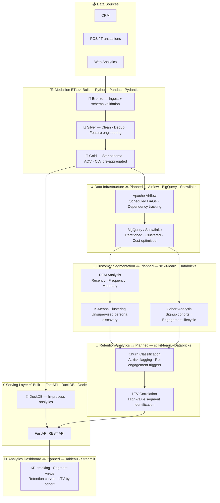

  

## 👋 Hi, I'm Deepan Mehta

> *"When learning meets data, growth becomes measurable and inevitable."*

> **Data Analytics | Data Engineering | AI Systems**
>
> Building end-to-end data solutions across ETL, analytics, and machine learning.
>
> **Current Project:** 🚲 [Bike Demand ML System](https://github.com/deepan-mehta-analytics/bike-demand-ml-system) — 6-city Random Forest inference API live on **GCP Cloud Run** (v4.5.0); RMSE accuracy gates in CI, cost-audit alerting via Slack, Cloud Logging + Prometheus metrics; companion [R Shiny dashboard](https://github.com/deepan-mehta-analytics/bike-demand-prediction) with live GBFS + weather feeds across 6 cities — next: drift monitoring pipeline (v4.6.0)

---

## 🌟 About Me

I'm a data-driven professional passionate about applying **AI, Data Engineering and Analytics** to improve **Business, Learning and Development (L&D)** outcomes.

After a successful career in **Aviation training and Airport operations**, I've transitioned toward **data engineering and data analytics**, where I can apply analytical methods to solve learning and business problems.

I build data-driven solutions covering:

- AI/ML Engineering — end-to-end training pipelines, inference APIs, and production cloud deployment
- Cloud Data Engineering — GCP Cloud Run, Artifact Registry, BigQuery; containerised CI/CD
- Observability — structured JSON logging (Cloud Logging), Prometheus metrics endpoints
- ETL pipelines and data workflows
- Exploratory data analysis and visualization
- Predictive modelling using Python and R
- Analytics dashboards and reporting systems (R Shiny, Tableau, Looker Studio)

---

## 🧠 Core Competencies

**Programming & Analysis:**

**ML Engineering & APIs:**

**Visualization & Reporting:**

**Cloud Data Engineering:**

---

## 💼 Featured Projects

| Project | Description | Tools |
|---------|-------------|-------|
| 🏗️ [Sales Data Pipeline (ETL)](https://github.com/deepan-mehta-analytics/sales-data-pipeline) | Built a production-grade ETL pipeline using Medallion architecture (Bronze/Silver/Gold) to transform raw sales data into validated, analytics-ready datasets with automated data quality checks, feature engineering, and CI/CD workflows. | Python, Pandas, DuckDB, Docker, GitHub Actions |
| 🚲 [Bike Demand Prediction System](https://github.com/deepan-mehta-analytics/bike-demand-prediction) | Built a 6-city live demand dashboard integrating OpenWeather forecasts, GBFS live station data, and a FastAPI ML backend. Features UC1 fleet rebalancing alerts and UC2 rider demand scores across Seoul, London, NYC, DC, Paris, and Chicago. | R, Shiny, httr, Leaflet, GBFS, FastAPI (backend), Docker, GitHub Actions |
| ⚙️ [Bike Demand ML System](https://github.com/deepan-mehta-analytics/bike-demand-ml-system) | Production ML inference API live on **GCP Cloud Run** (v4.5.0). Trains 6-city Random Forest models (Seoul, London, NYC, DC, Paris, Chicago); models baked into Docker image at build time. CI auto-publishes to GHCR + Artifact Registry and redeploys on merge via `gcloud run deploy`. RMSE accuracy gates in CI, cost-audit alerting via Slack, structured JSON logging → Cloud Logging, Prometheus `/metrics` endpoint. | Python, FastAPI, scikit-learn, Pydantic, Docker, GCP Cloud Run, Prometheus, GitHub Actions |
| 🏠 [StayOps — Rental Ops Console](https://github.com/deepan-mehta-analytics/stayops) | Multi-channel booking reconciliation engine and AI-assisted ops console for short/mid-term rental operators. Ingests bookings from CSV and Google Sheets (idempotent SHA-256 dedup), detects 4 conflict types automatically (duplicates, double-bookings, pricing anomalies, gap nights), and surfaces live KPI dashboards and SQL reports — built end-to-end with Claude Code on Next.js 16 + Supabase. Phase 2: Claude tool-calling agent layer. | TypeScript, Next.js 16, Drizzle ORM, Supabase, shadcn/ui, Anthropic SDK, Vercel |
| 🎓 Corporate Training Analytics Platform | Refactor->Re-write -> full-stack training records and analytics system to manage multi-course training programmes, featuring a unified data model, role-based admin dashboard, KPI tracking, event/result management, and reporting abstraction. | Java, SQL, Data Modeling, KPI Analytics, Role-Based Access |

---

## 📊 Architecture: Sales Data Pipeline — Current & Roadmap

> The Sales Data Pipeline evolves from a production-grade Medallion ETL into a full customer analytics platform — unifying transactions, segmentation, and retention into a single source of truth.

---

## 🎓 Certifications

- Google Data Analytics Professional Certificate
- IBM Data Analytics Professional Certificate with Excel & R

---

My mission is to bridge **Data Engineering and Learning** — using data to make learning, Business Analysis and training more effective.

---

## 📫 Contact

📍 Mumbai, India 
📧 [deepanmehta@live.com](mailto:deepanmehta@live.com) 
🔗 [LinkedIn](https://www.linkedin.com/in/d-mehta-054519341/) 
💼 [GitHub Projects](https://github.com/deepan-mehta-analytics?tab=repositories)

---

> *"When learning meets data, growth becomes measurable and inevitable."*
