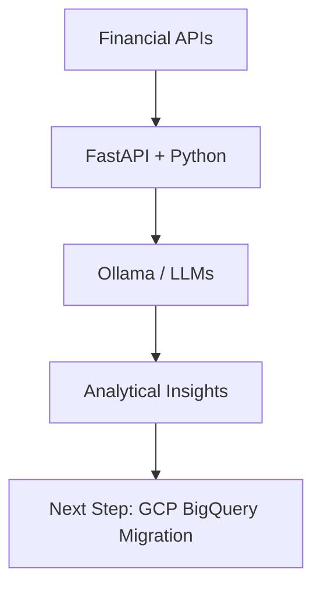

  

## 👋 Hi, I'm Deepan Mehta

> *"When learning meets data, growth becomes measurable and inevitable."*

> **Data Analytics | Data Engineering | AI Systems**
>
> Building end-to-end data solutions across ETL, analytics, and machine learning.
>
> **Current Project:** 📈 AI-Driven Financial Dashboard — Llama + FastAPI + Local LLM → transitioning to cloud

---

## 🌟 About Me

I'm a data-driven professional passionate about applying **AI, Data Engineering and Analytics** to improve **Business, Learning and Development (L&D)** outcomes.

After a successful career in **Aviation training and Airport operations**, I've transitioned toward **data engineering and data analytics**, where I can apply analytical methods to solve learning and business problems.

I build data-driven solutions covering:

- AI/ML Engineering
- ETL pipelines and data workflows
- Exploratory data analysis and visualization
- Predictive modeling using Python and R
- Analytics dashboards and reporting systems

---

## 🧠 Core Competencies

**Programming & Analysis:**

**ML Engineering & APIs:**

**Visualization & Reporting:**

**Cloud Data Engineering:**

---

## 💼 Featured Projects

| Project | Description | Tools |
|---------|-------------|-------|
| 🏗️ [Sales Data Pipeline (ETL)](https://github.com/deepan-mehta-analytics/sales-data-pipeline) | Built a production-grade ETL pipeline using Medallion architecture (Bronze/Silver/Gold) to transform raw sales data into validated, analytics-ready datasets with automated data quality checks, feature engineering, and CI/CD workflows. | Python, Pandas, DuckDB, Docker, GitHub Actions |
| 🚲 [Bike Demand Prediction System](https://github.com/deepan-mehta-analytics/bike-demand-prediction) | Built a 6-city live demand dashboard integrating OpenWeather forecasts, GBFS live station data, and a Python ML backend. Features UC1 fleet rebalancing alerts and UC2 rider demand scores across Seoul, London, NYC, DC, Paris, and Chicago. | R, Shiny, httr, Leaflet, GBFS, Docker, GitHub Actions |
| ⚙️ [Bike Demand ML System](https://github.com/deepan-mehta-analytics/bike-demand-ml-system) | Engineered a production-grade ML system with separate training and inference pipelines, schema-aligned feature engineering, and a FastAPI prediction service. Trains 4 city models baked into a Docker image at build time; published to GHCR via CI. | Python, FastAPI, scikit-learn, Pydantic, Docker, GHCR, CI/CD |
| 🧑‍💼 Financial Portfolio Analytics *(repo coming soon)* | Designing and developing a modular financial analytics platform for tracking and evaluating stock portfolios, integrating data pipelines, performance metrics, and API-driven insights within a scalable backend architecture. | Python, Pandas, FastAPI, LLM Integration |
| 🎓 Corporate Training Analytics Platform | Refactor->Re-write -> full-stack training records and analytics system to manage multi-course training programmes, featuring a unified data model, role-based admin dashboard, KPI tracking, event/result management, and reporting abstraction. | Java, SQL, Data Modeling, KPI Analytics, Role-Based Access |

---

## 📈 Featured Project (Work-in-progress): AI-Driven Financial Dashboard

> **Status:** Phase 1 (Local Analytics & AI Foundations)

This project integrates my **Google/IBM Data Analytics** background with modern AI (Ollama/local LLMs) to analyse market trends. I am currently transitioning this architecture to **Google Cloud Platform** as part of my PDE certification journey.

### 🛠️ Roadmap: Transitioning to Google Cloud (PDE Phase)

To move from local analytics to a scalable cloud architecture, the following is being implemented:

- **Data Ingestion:** Local CSV/API pulls are being migrated to **Google Cloud Storage (GCS)** for durable staging.
- **Data Warehousing:** A **BigQuery** schema is being designed with **Partitioning** and **Clustering** to optimise analytical query costs.
- **AI Integration:** Local Ollama inference is transitioning to **Vertex AI** for production-grade model scaling.
- **Automation:** **Cloud Functions** are being used to trigger FastAPI endpoints when new stock data is uploaded to GCS.

---

## 🎓 Certifications

- Google Data Analytics Professional Certificate
- IBM Data Analytics Professional Certificate with Excel & R

---

My mission is to bridge **Data Engineering and Learning** — using data to make learning, Business Analysis and training more effective.

---

## 📫 Contact

📍 Mumbai, India 
📧 [deepanmehta@live.com](mailto:deepanmehta@live.com) 
🔗 [LinkedIn](https://www.linkedin.com/in/d-mehta-054519341/) 
💼 [GitHub Projects](https://github.com/deepan-mehta-analytics?tab=repositories)

---

> *"When learning meets data, growth becomes measurable and inevitable."*
